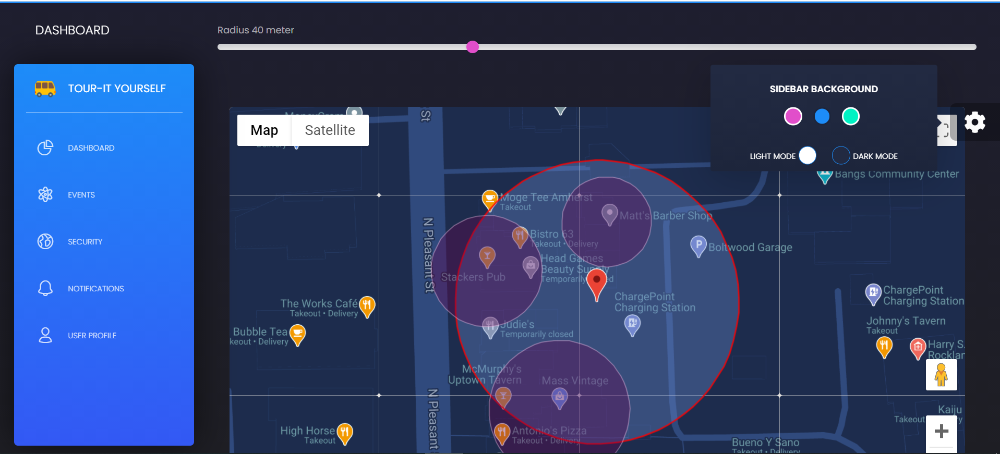
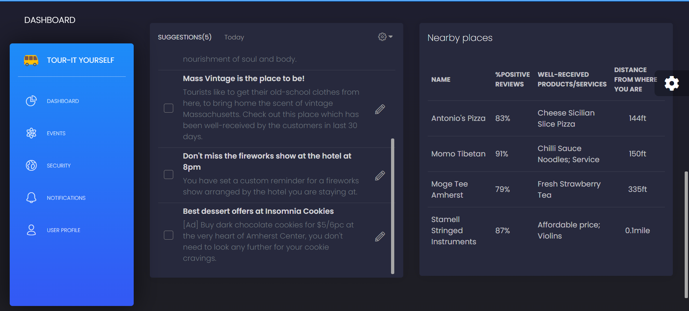
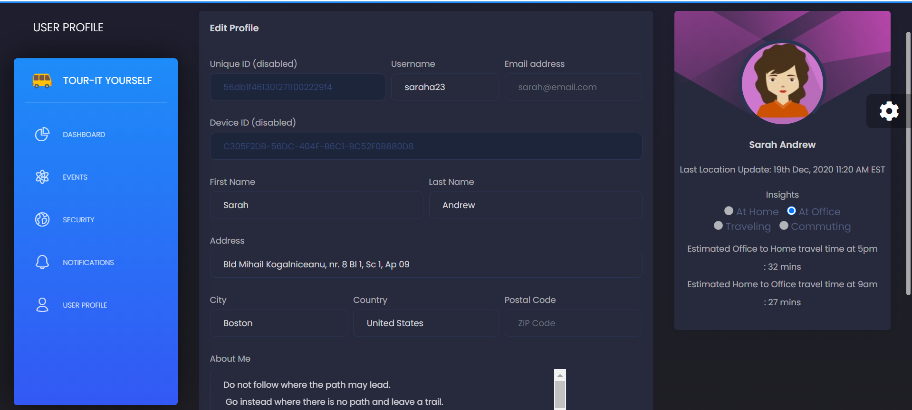
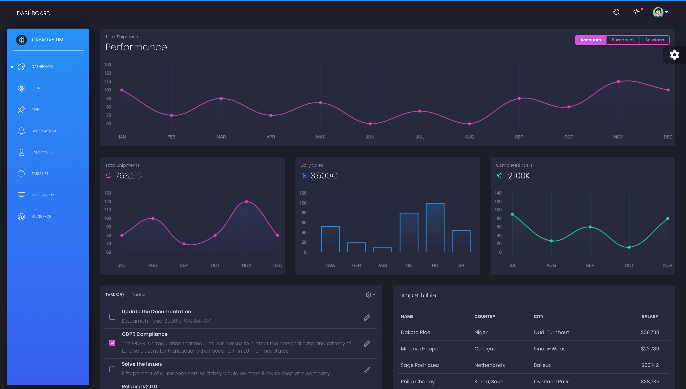
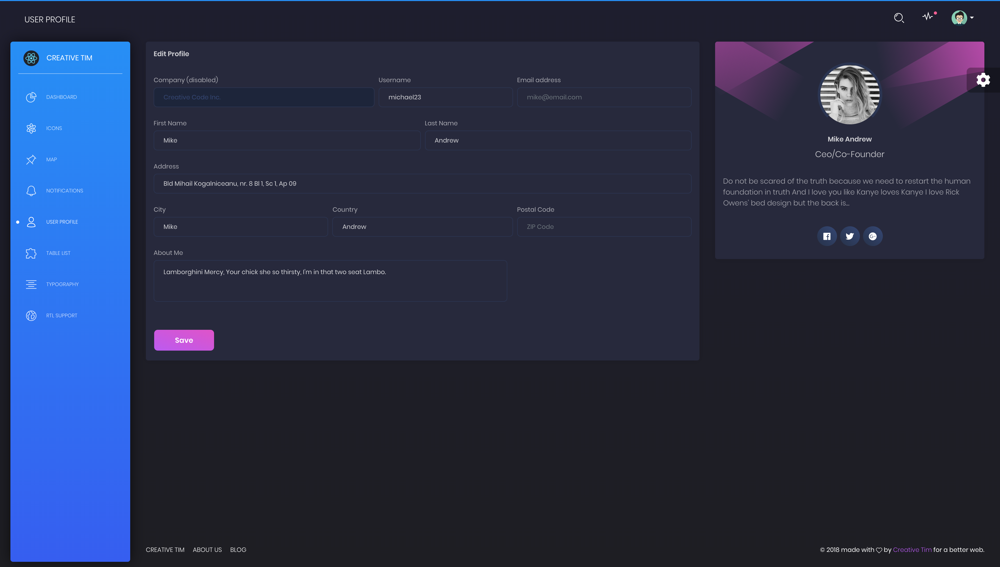
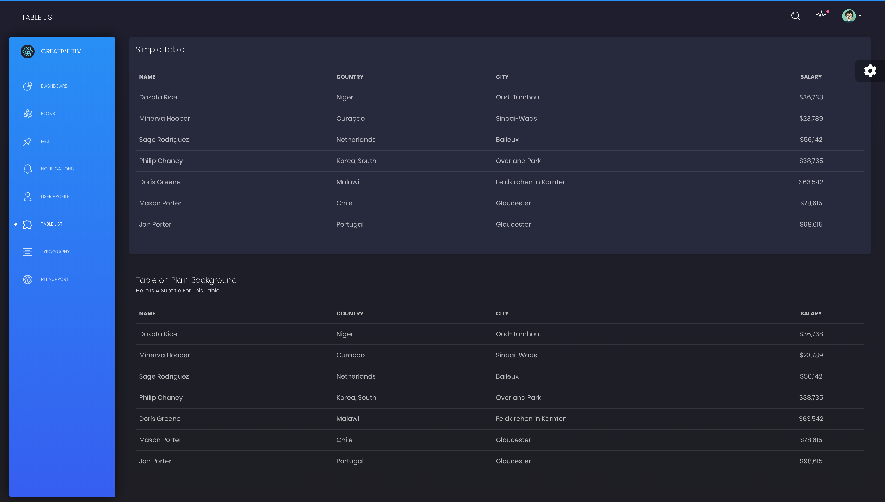
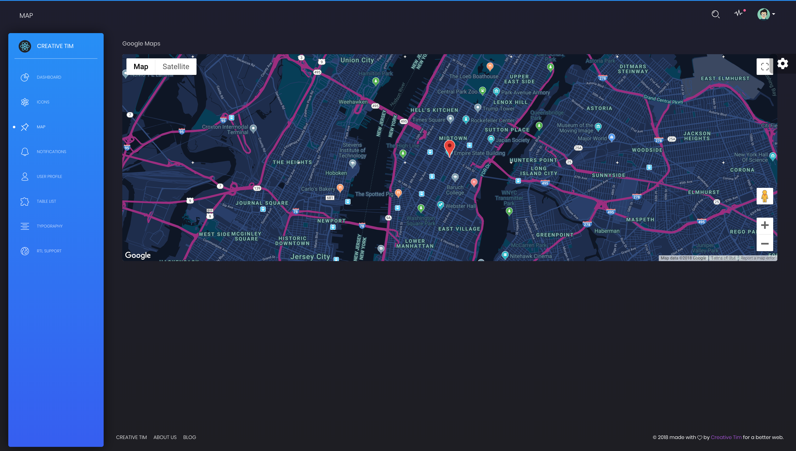

# [Tour-It Yourself](https://github.com/Astuary/TourItYourself)

 

Tour-it Yourself dashboard is a beautiful web-app made with [Bootstrap 4](http://getbootstrap.com/), [Reacstrap](https://reactstrap.github.io/) and [React](https://reactjs.org/) ([create-react-app](https://github.com/facebook/create-react-app)), it extends the functionality of [Radar.io](https://radar.io). Radar.io provides SDKs and APIs for geofencing, trip tracking, geocoding, and search; to solve Shopping/Retail, Finances/Banking, Food/Dining, Travelling etc. problems related to geography or consumer's location. 



First we mention the use of GeoFencing, Tracking, Searching, Distance calculating, et cetera's applications in real life:

🗺 Geofencing: Send a customized or tailored product advertisement to the consumers if they are nearby the store.

🚦 Tracking: A person's stolen items or credit cards can be tracked. Alarms can be raised if a consumer is not aware about their stolen credit card but as soon as there's an attempt to withdraw money, Radar.io can detect that the consumer is too far to have made that transaction.

🔎 Searching: If we can track a thing, we can search for it and require it. May it be your misplaced car keys or a wedding ring, nothing will be lost forever between the folds of your couch again.

🧮 Distance: Precise distance between two locations can be calculated, taking into account the weather, the traffic, and the user's tendencies in driving.

👨🏼‍💻 Geocoding: IP addresses are enough to get the location of a device. This can be put to good use in tracking down the crimes.

🌆 Region exploration: Information about the region you are in, its landmarks, famous food shops, shopping centers can be extracted. Boosting up the Tourism Industry.

🏗 Places: Get information about a store, what they are selling, are there any discounts, what's famous among their products or services.

We have adaptively designed this user-friendly dashboard [Credit](https://github.com/creativetimofficial/black-dashboard-react/blob/master/LICENSE.md), which combines colors that are easy on the eye, spacious cards, beautiful typography, and graphics. Our goal was to be transparent with the end user in telling them what exactly we are tracking and why. It is light and easy to use, and also very powerful. Simplicity is the hardest thing to implement.

React.js comes packed with all plugins that you might need inside a project and with the documentation on "how to get started". This web-app features over 16 individual components, giving you the freedom of choosing and combining; experimenting with the different styles from the thousands of possible combinations. All components can take variations in color, that you can easily modify using SASS files. You will save a lot of time going from prototyping to full-functional code because all elements are implemented.

We thought about everything, so this dashboard comes with 2 versions, Dark Mode and Light Mode.

Special thanks go for the owners of this plugin:
- [Perfect Scrollbar](http://utatti.github.io/perfect-scrollbar/) for the nice scrollbars for windows.

**Example Pages** We wanted to fully display the power of Radar.io, so the app comes packed with examples showing you how to use the components, and the Radar.io API.

## Table of Contents

* [Functionality](#functionality)
* [Demo](#demo)
* [Quick Start](#quick-start)
* [Documentation](#documentation)
* [File Structure](#file-structure)
* [Browser Support](#browser-support)
* [Resources](#resources)
* [Reporting Issues](#reporting-issues)
* [Technical Support or Questions](#technical-support-or-questions)
* [Licensing](#licensing)
* [Useful Links](#useful-links)


## Functionality

| Dashboard Map | Dashboard Memo and Suggestions | Events | Notifications | Security | User Settings and Preferences |
| --- | --- | --- | --- | --- | --- |
| [](https://) | [](https://) | [](https://) |  [](https://) | [](https://) | [](https://) |

## Demo

| Dashboard | User Profile | Tables | Maps | Notification |
| --- | --- | --- | --- | --- |
| [](https://demos.creative-tim.com/black-dashboard-react/#/dashboard) | [](https://demos.creative-tim.com/black-dashboard-react/#/user-page) | [](https://demos.creative-tim.com/black-dashboard-react/#/table-list) | [](https://demos.creative-tim.com/black-dashboard-react/#/maps) | [](https://demos.creative-tim.com/black-dashboard-react/#/notifications)

[View More](https://demos.creative-tim.com/black-dashboard-react/#/dashboard).


## Quick start

Quick start options:

- Clone the repo: `git clone https://github.com/creativetimofficial/black-dashboard-react.git`.
- [Download from Github](https://github.com/creativetimofficial/black-dashboard-react/archive/master.zip).
- [Download from Creative Tim](https://www.creative-tim.com/product/black-dashboard-react).


## Documentation
The documentation for the Black Dashboard React is hosted at our [website](https://demos.creative-tim.com/black-dashboard-react/#/documentation/tutorial).


## File Structure

Within the download you'll find the following directories and files:

```
black-dashboard-react
.
├── package.json
├── CHANGELOG.md
├── ISSUE_TEMPLATE.md
├── LICENSE.md
├── README.md
├── Documentation
│   └── documentation.html
├── github-assets
│   └── react.svg
├── public
│   ├── index.html
│   └── manifest.json
└── src
    ├── index.js
    ├── logo-white.svg
    ├── logo.svg
    ├── routes.js
    ├── assets
    │   ├── css
    │   ├── demo
    │   ├── fonts
    │   ├── img
    │   └── scss
    │       ├── black-dashboard
    │       │   ├── bootstrap
    │       │   │   ├── mixins
    │       │   │   └── utilities
    │       │   ├── custom
    │       │   │   ├── cards
    │       │   │   ├── mixins
    │       │   │   ├── utilities
    │       │   │   └── vendor
    │       └── black-dashboard.scss
    ├── components
    │   ├── FixedPlugin
    │   │   └── FixedPlugin.js
    │   ├── Footer
    │   │   └── Footer.js
    │   ├── Navbars
    │   │   ├── AdminNavbar.js
    │   │   └── RTLNavbar.js
    │   └── Sidebar
    │       └── Sidebar.js
    ├── layouts
    │   ├── Admin
    │   │   └── Admin.js
    │   └── RTL
    │       └── RTL.js
    ├── variables
    │   └── charts.js
    └── views
        ├── Dashboard.js
        ├── Icons.js
        ├── Map.js
        ├── Notifications.js
        ├── Rtl.js
        ├── TableList.js
        ├── Typography.js
        └── UserProfile.js
```

## Browser Support

At present, we officially aim to support the last two versions of the following browsers:

    


## Resources
- Demo: https://demos.creative-tim.com/black-dashboard-react/#/dashboard
- Download Page: https://www.creative-tim.com/product/black-dashboard-react
- Documentation: https://demos.creative-tim.com/black-dashboard-react/#/documentation/tutorial
- License Agreement: https://www.creative-tim.com/license
- Support: https://www.creative-tim.com/contact-us
- Issues: [Github Issues Page](https://github.com/creativetimofficial/black-dashboard-react/issues)

## Reporting Issues
We use GitHub Issues as the official bug tracker for the Black Dashboard React. Here are some advices for our users that want to report an issue:

1. Make sure that you are using the latest version of the Black Dashboard React. Check the CHANGELOG from your dashboard on our [website](https://www.creative-tim.com/).
2. Providing us reproducible steps for the issue will shorten the time it takes for it to be fixed.
3. Some issues may be browser specific, so specifying in what browser you encountered the issue might help.

## Technical Support or Questions

If you have questions or need help integrating the product please [contact us](https://www.creative-tim.com/contact-us) instead of opening an issue.

## Licensing

- Copyright 2020 Creative Tim (https://www.creative-tim.com)
- Licensed under MIT (https://github.com/creativetimofficial/black-dashboard-react/blob/master/LICENSE.md)

## Useful Links

More products from Creative Tim: <https://www.creative-tim.com/products>

Tutorials: <https://www.youtube.com/channel/UCVyTG4sCw-rOvB9oHkzZD1w>

Freebies: <https://www.creative-tim.com/products>

Affiliate Program (earn money): <https://www.creative-tim.com/affiliates/new>

Social Media:

Twitter: <https://twitter.com/CreativeTim>

Facebook: <https://www.facebook.com/CreativeTim>

Dribbble: <https://dribbble.com/creativetim>

Google+: <https://plus.google.com/+CreativetimPage>

Instagram: <https://instagram.com/creativetimofficial>
